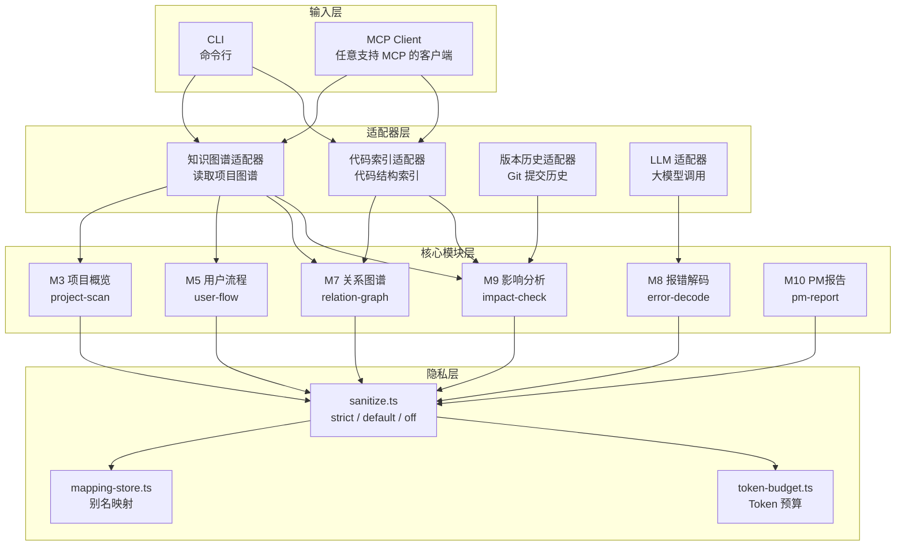

# codefanyi

<p align="center">
  = 22">
  
  
  
</p>

> **你的代码跑在本地，解释也跑在本地。** 不用把代码上传到任何云端，就能让非技术人员看懂项目在干什么。

---

## 这是什么

**codefanyi** 是一个本地优先的代码白话化工具——把项目结构、报错信息、用户流程、代码改动影响，翻译成非技术人员一眼能懂的普通话。

它的目标不是替你写代码，而是**帮你向产品经理、设计师、老板解释你写的代码**。

核心特点：

- **本地优先**：分析在本地完成，默认不上传代码
- **面向非技术人员**：输出写给 PM / 设计师 / 老板看，不是写给程序员看
- **四段式结构**：每条解释固定为「它在说什么 / 为什么 / 现在该做什么 / 风险」
- **全局项目感知**：扫描整个项目生成关系图，而不是只看单个文件
- **双入口**：CLI 命令行 + MCP Server，可嵌入任何 Agent 工作流

基于 Node.js、TypeScript、MCP SDK 构建。

---

## 架构

总共 **10 个核心模块**，通过 **4 个适配器** 对接数据源，统一经过 **隐私脱敏层** 后输出。



---

## 快速开始

```bash
# 1. 克隆仓库
git clone git@github.com:DONGaOtang/codefanyi.git
cd codefanyi

# 2. 安装依赖
pnpm install

# 3. 构建
pnpm build

# 4. 运行测试
pnpm test
```

### 常用命令

```bash
pnpm cli --help      # 查看 CLI 帮助
pnpm dev             # 开发模式启动 MCP Server（热重载）
pnpm start           # 启动构建后的 MCP Server
pnpm run typecheck   # TypeScript 类型检查
```

> **不想配 API Key？** 所有命令都支持 `--no-llm`，纯本地分析，不调用任何外部大模型 API。

---

## 使用方式

### CLI（直接在终端用）

#### 解释报错 → 大白话

```bash
$ pnpm cli error "TypeError: Cannot read properties of undefined"
```

```
【它在说什么】
程序想从一个"空盒子"里拿东西，但那个盒子根本不存在。
就像你打开抽屉找文件，但抽屉是空的。

【为什么会这样】
某个变量或数据在使用前没有被正确赋值或加载。

【你现在该干嘛】
1. 找到报错提到的变量
2. 在使用前检查该变量是否为空
3. 添加默认值或条件判断

【风险】
如果不处理，程序可能无法正常运行或产生错误结果。

【术语对照】
undefined → 未定义/没有值
properties → 属性/字段
```

#### 项目概览（纯本地，不调大模型）

```bash
$ pnpm cli project ./my-app --no-llm
```

```
【这个项目是什么】
该项目包含 15 个文件和 8 个代码模块。

【它由哪几部分组成】
  • auth
  • business
  • api

【需要注意的】
这是基于本地图谱的自动分析，可能不完全准确。
建议在编辑器中查看完整项目结构。
```

#### 其他命令

```bash
pnpm cli relation ./my-app              # 模块依赖关系
pnpm cli impact ./my-app src/login.ts   # 改动影响分析
pnpm cli flow ./my-app --no-llm         # 用户操作路径
pnpm cli report ./my-app --no-llm       # PM 视角项目报告
```

### MCP Server（嵌入 Agent 工作流）

在任意支持 MCP 的客户端配置文件中添加：

```json
{
  "mcpServers": {
    "codefanyi": {
      "command": "node",
      "args": ["C:/path/to/codefanyi/dist/server/index.js"],
      "env": {
        "ANTHROPIC_API_KEY": "你的API Key",
        "PRIVACY_MODE": "default"
      }
    }
  }
}
```

暴露 6 个工具：

| 工具名 | 功能 | 对应模块 |
|--------|------|----------|
| `explain_project` | 项目大白话概览 | M3 |
| `explain_flow` | 用户操作路径和页面跳转 | M5 |
| `explain_relation` | 模块关系说明 | M7 |
| `explain_error` | 报错翻译成大白话 | M8 |
| `explain_impact` | 改动影响范围分析 | M9 |
| `explain_report` | PM 视角项目报告 | M10 |

---

## 隐私：代码不出你的机器

这是 codefanyi 与云端 AI 工具最根本的区别。

### 三种模式

| 模式 | 传给大模型的内容 | 适用场景 |
|------|-----------------|----------|
| **default**（默认） | 脱敏后的结构摘要，文件名替换为 `file_a1b2c3` | 日常使用 |
| **strict** | 不传任何项目结构和路径信息 | 金融/医疗/合规项目 |
| **off** | 传真实文件名和行号（需主动开启） | 个人项目或调试场景 |

### 脱敏机制

- **路径脱敏**：`src/user/auth/login.ts` → `file_a1b2c3`
- **符号脱敏**：函数名、类名 → `symbol_d4e5f6`
- **结构脱敏**：保留模块数量和关系，去掉所有真实名称
- **映射可逆**：本地维护真实名→别名映射表，方便回溯

### `--no-llm`：零外部调用

所有命令都支持 `--no-llm` 标志。开启后完全不调用外部大模型 API，只输出本地分析的 JSON 摘要。适合：

- 只想快速浏览项目结构
- 严格网络隔离环境
- 还没配 API Key 但想先试试

---

## 环境要求

- **Node.js** >= 22.0.0
- **pnpm** >= 10.x

---

## 许可

[MIT License](./LICENSE)
