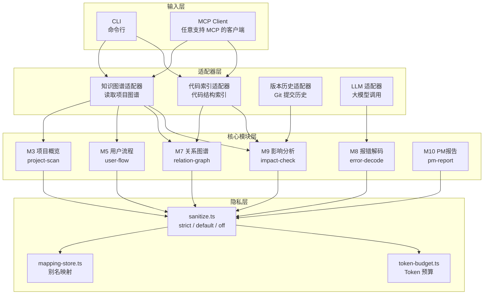

# codefanyi

<p align="center">
  = 22">
  
  
  
</p>

> **本地优先的代码白话翻译工具。** 代码跑在你机器上，解释也跑在你机器上——不用上传到任何云端，就能让非技术人员一眼看懂项目在干什么。

---

## 目录

- [这是什么](#这是什么)
- [核心能力一览](#核心能力一览)
- [架构](#架构)
- [快速开始](#快速开始)
- [使用方式](#使用方式)
  - [CLI 命令行模式](#cli-命令行模式)
  - [MCP Server 模式](#mcp-server-模式)
  - [/colt Skill 模式](#colt-skill-模式)
- [许可](#许可)

---

## 这是什么

<small>这段讲 codefanyi 的定位——它是谁、给谁用、跟其他工具有什么不一样。</small>

**codefanyi** 把项目结构、报错信息、用户流程、代码改动影响，翻译成非技术人员一眼能懂的普通话。它的目标不是替你写代码，而是**帮你向产品经理、设计师、老板解释你写的代码**。

三件事让它跟别的工具不同：

1. **本地优先**——分析在本地完成，默认不把代码发到云端
2. **写给非技术人员看**——输出是 PM / 设计师 / 老板能读懂的，不是程序员的黑话
3. **四段式结构**——每条解释固定为「它在说什么 / 为什么 / 现在该做什么 / 风险」，拿到就能用

基于 Node.js、TypeScript、MCP SDK 构建。

---

## 核心能力一览

<small>这段列出 codefanyi 能干什么。三种入口覆盖不同使用场景，能力完全一致。</small>

| 入口 | 说明 |
|------|------|
| **CLI 命令行** | 终端里直接敲命令，6 个子命令覆盖项目概览、报错翻译、关系分析、影响评估、用户流程、PM 报告 |
| **MCP Server** | 接入任意 MCP 客户端（如 Qoder），提供 6 个工具，用大白话聊天就能触发，不用记命令 |
| **`/colt` Skill** | 在 MCP 基础上叠加指令层，敲 `/colt` 一键生成四段式「全栈分析报告.md」，自动写到你当前项目里 |

三种入口共享同一套底层模块（M3–M10），无论你从哪条路进来，分析质量和输出结构完全一致。

---

## 架构

<small>这段用图展示代码怎么组织的——数据从哪来、经过哪些模块、隐私层在哪。</small>

总共 **10 个核心模块**，通过 **4 个适配器** 对接数据源，统一经过 **隐私脱敏层** 后输出。



---

## 快速开始

<small>这段是从零到跑通的全部命令。先装环境、再拉代码、最后构建。5 分钟搞定。</small>

### 前置环境

| 依赖 | 最低版本 |
|------|----------|
| Node.js | >= 22.0.0 |
| pnpm | >= 10.x |

### 安装与构建

```bash
# 1. 克隆仓库
git clone git@github.com:DONGaOtang/codefanyi.git
cd codefanyi

# 2. 安装依赖
pnpm install

# 3. 构建
pnpm build

# 4. 运行测试（确认一切正常）
pnpm test
```

### 所有可用命令

| 命令 | 干什么 |
|------|--------|
| `pnpm setup` | 初始化运行环境 |
| `pnpm dev` | 开发模式启动 MCP Server（代码改了就热重载） |
| `pnpm cli --help` | 查看 CLI 帮助，列出所有子命令 |
| `pnpm cli <子命令>` | 跑 CLI 分析（子命令见下方 CLI 章节） |
| `pnpm build` | 编译 TypeScript 到 `dist/` |
| `pnpm start` | 启动构建后的 MCP Server |
| `pnpm test` | 运行全部测试 |
| `pnpm typecheck` | TypeScript 类型检查（不输出文件） |

> **不想配 API Key？** 所有分析命令都支持 `--no-llm`，纯本地跑，不调任何外部大模型。

---

## 使用方式

### CLI 命令行模式

<small>这段讲怎么在终端里用——每个子命令都给出真实的输入和输出，复制就能跑。</small>

所有 CLI 命令统一通过 `pnpm cli` 调用，共 6 个子命令。每个命令都支持两个可选参数：

| 参数 | 作用 |
|------|------|
| `--no-llm` | 纯本地分析，不调用外部大模型（零外部 API 调用） |
| `--privacy <mode>` | 隐私模式：`default`（默认脱敏）/ `strict`（全隐藏）/ `off`（关脱敏） |

#### `error` — 报错翻译成大白话

```bash
$ pnpm cli error "TypeError: Cannot read properties of undefined"
```

```
【它在说什么】
程序想从一个"空盒子"里拿东西，但那个盒子根本不存在。
就像你打开抽屉找文件，但抽屉是空的。

【为什么会这样】
某个变量或数据在使用前没有被正确赋值或加载。

【你现在该干嘛】
1. 找到报错提到的变量
2. 在使用前检查该变量是否为空
3. 添加默认值或条件判断

【风险】
如果不处理，程序可能无法正常运行或产生错误结果。

【术语对照】
undefined → 未定义/没有值
properties → 属性/字段
```

#### `project` — 项目整体概览

```bash
$ pnpm cli project ./my-app --no-llm
```

```
【这个项目是什么】
该项目包含 15 个文件和 8 个代码模块。

【它由哪几部分组成】
  • auth
  • business
  • api

【需要注意的】
这是基于本地图谱的自动分析，可能不完全准确。
建议在编辑器中查看完整项目结构。
```

#### `relation` — 模块依赖关系

```bash
$ pnpm cli relation ./my-app --no-llm
```

```
【整体关系】
检测到 8 个模块和 5 个关联关系。

【关键连接】
  • node_1 → node_2 (routes_to)
  • node_2 → node_3 (depends_on)

【风险评估】
被最多模块依赖的节点改动影响最大，请重点关注。
```

#### `impact` — 改动影响范围

```bash
$ pnpm cli impact ./my-app src/login.ts --no-llm
```

```
【你改的东西】
你修改了以下文件：src/login.ts

【直接影响】
修改的文件直接影响与其相关的功能模块。

【可能影响】
改动可能影响依赖该文件的其他模块。建议检查项目中的导入关系。

【建议】
改完后建议：1. 受影响页面的基本功能 2. 关联模块的核心流程 3. 边界情况和错误处理
```

#### `flow` — 用户操作路径

```bash
$ pnpm cli flow ./my-app --no-llm
```

分析项目中的页面跳转、路由配置、核心操作流程，输出用户视角的操作路径说明。

#### `report` — PM 视角项目报告

```bash
$ pnpm cli report ./my-app --no-llm
```

生成包含项目概览、技术健康度、进度评估和风险提示的报告，适合给非技术的项目决策者看。

---

### MCP Server 模式

<small>这段讲怎么把 codefanyi 接进 Qoder 或任何 MCP 客户端——配好 JSON，之后用正常聊天就能触发，不用记任何命令。</small>

#### 第一步：连接 MCP Server

在 Qoder 或其他 MCP 客户端的 MCP 设置中，添加以下配置：

```json
{
  "mcpServers": {
    "codefanyi": {
      "command": "node",
      "args": ["C:/path/to/codefanyi/dist/server/index.js"],
      "env": {
        "ANTHROPIC_API_KEY": "你的API Key",
        "PRIVACY_MODE": "default"
      }
    }
  }
}
```

> 把路径换成你机器上 `codefanyi` 的实际位置。保存后客户端自动拉起进程，MCP 面板里 `codefanyi` 亮绿灯就表示连上了。

#### 第二步：直接聊天触发

**不需要斜杠命令、不需要记工具名。** 你正常跟 Agent 聊，Agent 看到工具箱里有 6 个工具，自己判断该调哪个。

例如你说一句：
> "帮我解释一下这个报错：TypeError: Cannot read properties of undefined"

Agent 自动识别到 `explain_error` 工具，调用它，把大白话结果直接返回在对话框里。

#### 6 个 MCP 工具

| 工具名 | 它干什么 |
|--------|----------|
| `explain_project` | 扫描整个项目，用大白话讲清楚结构和用途 |
| `explain_relation` | 说清楚模块之间的依赖和连接关系 |
| `explain_flow` | 描述用户操作路径、页面跳转和核心流程 |
| `explain_error` | 把程序报错翻译成非技术人员看得懂的解释 |
| `explain_impact` | 分析你改了一个文件后，会影响哪些其他地方 |
| `explain_report` | 生成 PM 视角的项目报告（概览、健康度、风险） |

#### 隐私说明

MCP 模式同样遵循三种隐私策略。通过配置的 `PRIVACY_MODE` 环境变量控制：

- `default`：文件名和路径会脱敏（`src/login.ts` → `file_a1b2c3`），日常推荐
- `strict`：不传任何项目结构信息，适合金融/医疗等合规场景
- `off`：传真实文件名，适合个人项目

---

### `/colt` Skill 模式

<small>这段讲 `/colt`——codefanyi 最完整的打开方式。敲一条指令，自动调 4 个 MCP 工具，拼成一份结构化 Markdown 报告，直接落到你项目根目录。</small>

`/colt` 是挂在 MCP Server 之上的 Skill 层——MCP 负责干活，Skill 负责编排：按顺序调工具、组装文章、写文件。

#### 7 个子命令路由

| 指令 | 干什么 | 产出 |
|------|--------|------|
| `/colt` | 全栈大总结（默认） | 调用 4 个工具，生成「全栈分析报告.md」 |
| `/colt project` | 项目整体概览 | 对话中返回结果 |
| `/colt relation` | 模块接洽关系 | 对话中返回结果 |
| `/colt flow` | 用户操作 / 业务逻辑流 | 对话中返回结果 |
| `/colt error <报错>` | 报错大白话解码 | 对话中返回结果 |
| `/colt impact <文件>` | 改动影响范围 | 对话中返回结果 |
| `/colt report` | PM 视角项目报告 | 对话中返回结果 |

#### 全栈大总结报告结构

敲 `/colt`（不带参数）时，Agent 依次调用 `explain_project` → `explain_relation` → `explain_flow` → `explain_report`，拼成一张完整的四段式报告：

```
全栈分析报告.md
├─ 一、项目大总结      整个项目是干什么的、解决什么问题
├─ 二、逐文件/模块说明  每个核心文件/模块在讲什么、承担什么职责
├─ 三、逻辑梳理        核心业务逻辑、数据怎么流动
└─ 四、接洽关系        模块之间怎么连接、下一步流向哪
```

每段都走「它在说什么 / 为什么 / 现在该做什么 / 风险」的固定模板，面向非技术人员。

#### 报告放在哪

**报告落在你当前正在分析的项目根目录**，不是 codefanyi 自己的目录。比如你在分析 `my-app`，报告就在 `my-app/全栈分析报告.md`。

#### Skill 部署

Skill 文件已随本仓库分发在 `.qoder/skills/colt/SKILL.md`。要在**所有项目**中都能用 `/colt`，把整个 `colt` 文件夹复制到全局路径：

```
~/.qoder/skills/colt/SKILL.md
```

复制后重启 Qoder，在任何项目里敲 `/colt` 即可触发。

---

## 许可

[MIT License](./LICENSE)
