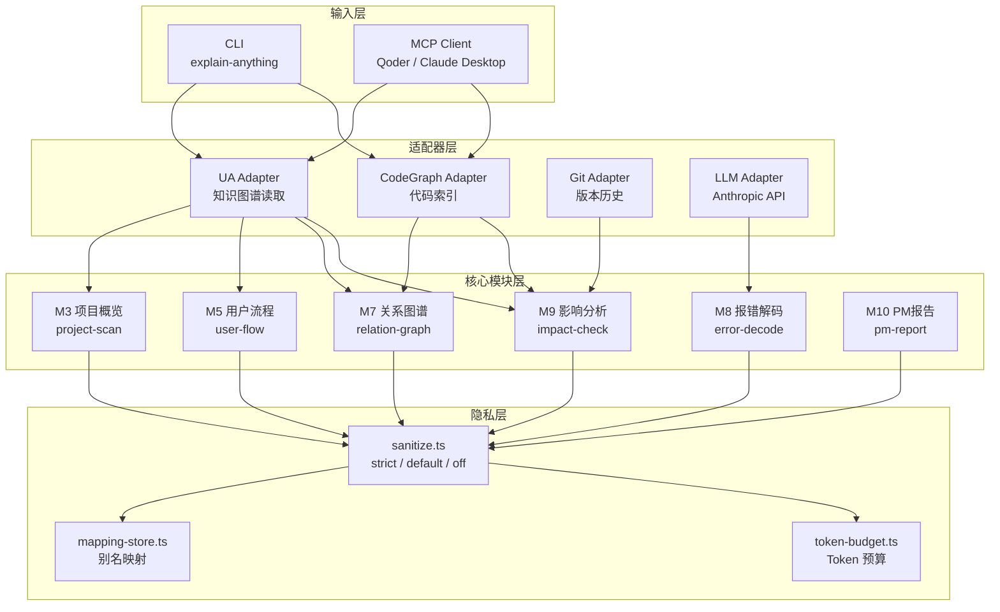

# Explain Anything

<p align="center">
  = 22">
  
  
  
</p>

> **你的代码跑在本地，解释也跑在本地。** 不用把代码上传到任何云端 AI，就能让非技术人员看懂项目在干什么。

---

## 一句话定位

**Explain Anything** 是一个本地优先的代码白话化工具——把项目结构、报错信息、用户流程、代码改动影响翻译成非技术人员一眼能懂的普通话。跟 Cursor、Copilot Chat 这些纯写代码的 AI 不同，它的目标不是替你写代码，而是**帮你向产品经理、设计师、老板解释你写的代码**。

### 为什么不用 Cursor / ChatGPT 解释代码？

| 场景 | Cursor / Copilot Chat | Explain Anything |
|------|----------------------|------------------|
| 隐私 | 代码全文发到云端 | 本地脱敏，默认不传真实路径 |
| 输出对象 | 写给程序员看的 | 写给 PM/设计师/老板看的 |
| 输出结构 | 随意回答 | 固定四段式：它在说什么 / 为什么 / 现在该做什么 / 风险 |
| 项目感知 | 只能看当前文件 | 扫描整个项目，生成全局关系图 |
| 集成方式 | IDE 插件 | MCP Server + CLI，可嵌入任何 Agent 工作流 |

---

## 架构

总共 **10 个核心模块**，通过 **4 个适配器** 对接上游数据源，统一经过 **隐私脱敏层** 后输出。



---

## 快速开始

```bash
# 1. 克隆
git clone git@github.com:DONGaOtang/codefanyi.git
cd codefanyi

# 2. 安装依赖
pnpm install

# 3. 配置 API Key（可选——不配也能用 --no-llm 模式）
cp .env.example .env
# 编辑 .env：ANTHROPIC_API_KEY=sk-ant-xxx

# 4. 构建
pnpm run build
```

> **不想配 API Key？** 加 `--no-llm` 就行，所有命令都支持纯本地分析，不调用任何外部 API。

---

## 两种使用方式

### CLI（直接在终端用）

#### 解释报错 → 大白话

```bash
$ explain-anything error "TypeError: Cannot read properties of undefined"
```

```
【它在说什么】
程序想从一个"空盒子"里拿东西，但那个盒子根本不存在。
就像你打开抽屉找文件，但抽屉是空的。

【为什么会这样】
某个变量或数据在使用前没有被正确赋值或加载。

【你现在该干嘛】
1. 找到报错提到的变量
2. 在使用前检查该变量是否为空
3. 添加默认值或条件判断

【风险】
如果不处理，程序可能无法正常运行或产生错误结果。

【术语对照】
undefined → 未定义/没有值
properties → 属性/字段
```

#### 项目概览（纯本地，不调 AI）

```bash
$ explain-anything project ./my-app --no-llm
```

```
【这个项目是什么】
该项目包含 15 个文件和 8 个代码模块。

【它由哪几部分组成】
  • auth
  • business
  • api

【需要注意的】
这是基于本地图谱的自动分析，可能不完全准确。
建议在编辑器中查看完整项目结构。
```

#### 其他命令

```bash
explain-anything relation ./my-app     # 模块依赖关系
explain-anything impact ./my-app src/login.ts  # 改动影响分析
explain-anything flow ./my-app --no-llm        # 用户操作路径
explain-anything report ./my-app --no-llm      # PM 视角项目报告
```

### MCP Server（嵌入 Agent 工作流）

在 Qoder 或 Claude Desktop 的 MCP 配置中添加：

```json
{
  "mcpServers": {
    "explain-anything": {
      "command": "node",
      "args": ["C:/path/to/codefanyi/dist/server/index.js"],
      "env": {
        "ANTHROPIC_API_KEY": "sk-ant-xxx",
        "PRIVACY_MODE": "default"
      }
    }
  }
}
```

暴露 6 个工具：

| 工具名 | 功能 | 对应模块 |
|--------|------|----------|
| `explain_project` | 项目大白话概览 | M3 |
| `explain_flow` | 用户操作路径和页面跳转 | M5 |
| `explain_relation` | 模块关系说明 | M7 |
| `explain_error` | 报错翻译成大白话 | M8 |
| `explain_impact` | 改动影响范围分析 | M9 |
| `explain_report` | PM 视角项目报告 | M10 |

---

## 隐私：代码不出你的机器

这是 Explain Anything 跟所有云端 AI 工具最根本的区别。

### 三种模式

| 模式 | 传给 LLM 的内容 | 适用场景 |
|------|-----------------|----------|
| **default**（默认） | 脱敏后的结构摘要，文件名替换为 `file_a1b2c3` | 日常使用 |
| **strict** | 不传任何项目结构和路径信息 | 金融/医疗/合规项目 |
| **off** | 传真实文件名和行号（你主动开） | 个人项目或调试场景 |

### 脱敏机制

- **路径脱敏**：`src/user/auth/login.ts` → `file_a1b2c3`
- **符号脱敏**：函数名、类名 → `symbol_d4e5f6`
- **结构脱敏**：保留模块数量和关系，去掉所有真实名称
- **映射可逆**：本地维护真实名→别名映射表，方便回溯

### `--no-llm`：零外部调用

所有命令都支持 `--no-llm` 标志。开启后完全不调 Anthropic API，只输出本地分析的 JSON 摘要。适合：

- 只想快速浏览项目结构
- 严格网络隔离环境
- 还没配 API Key 但想先试试

---

## 上游工具说明

| 工具 | 作用 | 是否必装 |
|------|------|----------|
| **Understand Anything** | 生成项目知识图谱（`.ua/knowledge-graph.json`），提升结构和关系分析精度 | 可选（无 UA 也能用基础分析） |
| **CodeGraph** | 代码索引，让关系分析和影响分析更准确 | 可选（不装也能正常用） |

> ⚠️ UA 的 `/understand` 命令可能会调用外部模型消耗 token，这部分不在 Explain Anything 的控制范围内。敏感项目建议先让 UA 配置本地模型。

---

## 环境要求

- **Node.js** >= 22.0.0
- **pnpm** >= 10.x

---

## 开发

```bash
pnpm install          # 安装依赖
pnpm run typecheck    # 类型检查
pnpm test             # 运行测试
pnpm run build        # 构建到 dist/
pnpm run dev          # 开发模式启动 MCP Server（tsx 热重载）
```

---

## 许可

[MIT License](./LICENSE)
